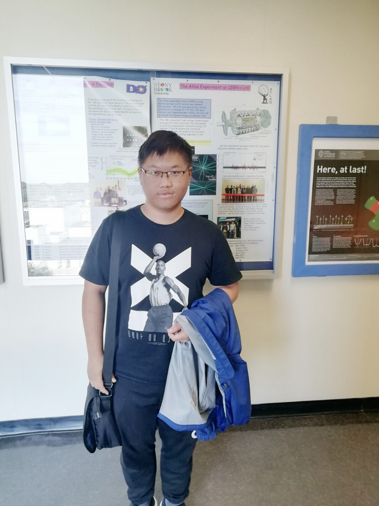
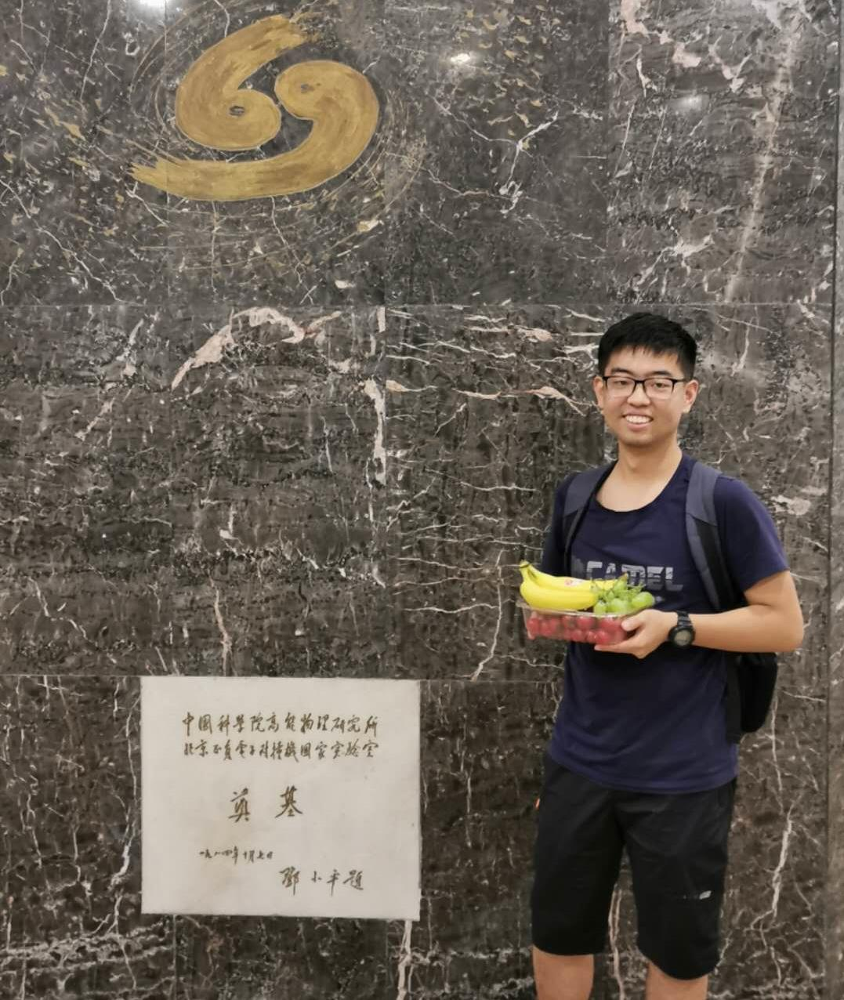

## Introduction

This is the webpage for Weimin Song's group.

### Research

1. Physics analysis at [BESIII](http://bes3.ihep.ac.cn) (and at [Large Hadron Collider](https://home.cern/science/accelerators/large-hadron-collider), will join later)
2. Silicon detector development
3. Study the physics potential for Circular Electron-Positrion Collider, [CEPC](CEPC.md)

 

 

### Group members

 

{:height="120px" width="100px"}  

 

[Weimin Song]() (Principal Investigator, Professor)  

 

[Hao Liang]() (Graduate student)  

 

{:height="120px" width="100px"}  

 

[Xionghao Wu](group/wuxhresearch.md) (Undergraduate student)  

 

{:height="120px" width="100px"}  

 

[Yipu Liao](liaoyp0615.github.io) (Undergraduate student)  

 

[Chuanxin Cui]() (Undergraduate student)  

 

[Jiayue yang]() (Undergraduate student)  

 

{:height="120px" width="100px"}  

 

[Xiang Li](https://phyxiangli.github.io/) (Undergraduate student)  

 

{:height="120px" width="100px"}  

 

[Yang Zhang](group/zhangyresearch.md) (Undergraduate student)  

 

{:height="120px" width="100px"}  

 

[Zhizhong Ding](group/dingzzresearch.md) (Undergraduate student)  

 

[Xiaopeng Xie](group/xiexpresearch.md) (Undergraduate student)  

 

......

 

 

### Contact information

Office: 314 Physics Building, Jilin University, Changchun

Email: weiminsong@jlu.edu.cn

Phone: 15201291914

###### You can use the [editor on GitHub](https://github.com/weiminsong/SONGGROUP.github.io/edit/master/README.md)
