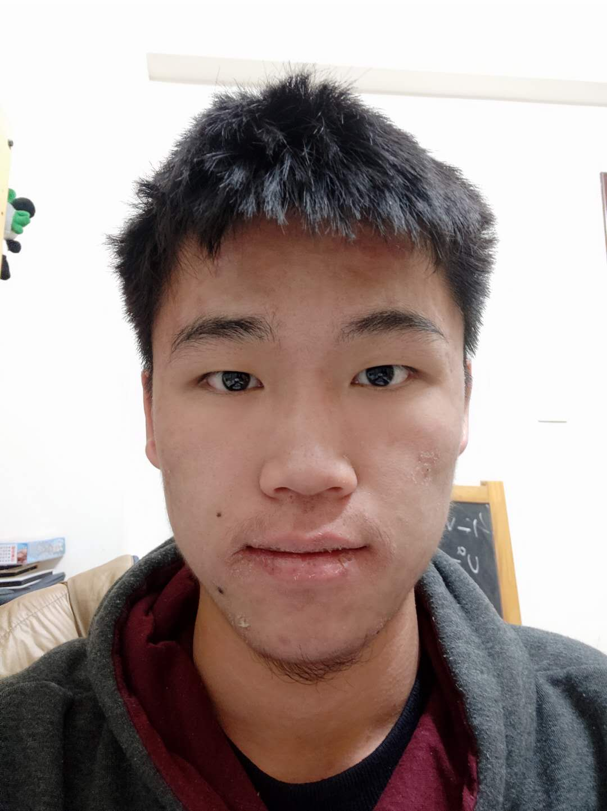

## Introduction

You can use the [editor on GitHub](https://github.com/weiminsong/SONGGROUP.github.io/edit/master/README.md)

### Research

1. Physics analysis at [BESIII](http://bes3.ihep.ac.cn) (and at [Large Hadron Collider](https://home.cern/science/accelerators/large-hadron-collider), will join later)
2. Silicon detector development
3. Study the physics potential for Circular Electron-Positrion Collider, [CEPC](CEPC.md)

### Group members
 
{:height="120px" width="100px"}
 
[Weimin Song]() (Group leader, Professor)

  

 
[Hao Liang]() (Graduate student)

  
{:height="120px" width="100px"}
 
[Xionghao Wu]() (Undergraduate student)

  
{:height="120px" width="100px"}
 
[Yipu Liao](https://liaoyp0615.github.io) (Undergraduate student)

  
{:height="120px" width="100px"}
 
[Chuanxin Cui]() (Undergraduate student)

  
{:height="120px" width="100px"}
 
[Jiayue yang]() (Undergraduate student)
......

### Contact information

Office: 314 Physics Building, Jilin University, Changchun

Email: weimin.song@stfc.ac.uk

Phone: 15201291914
